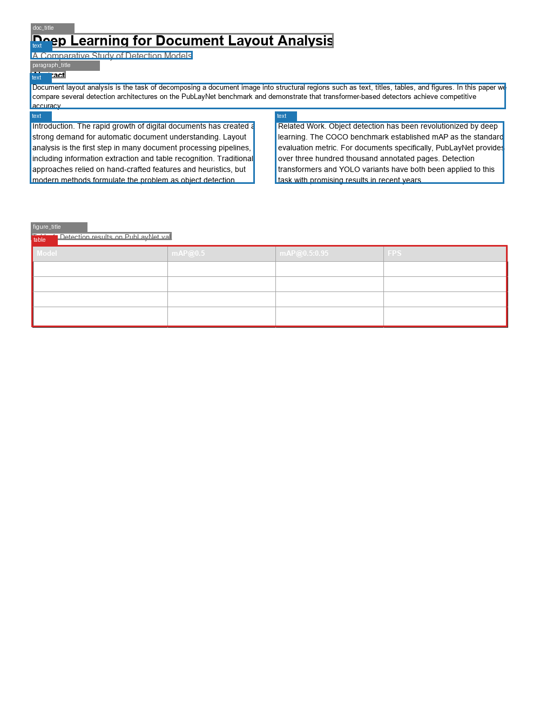
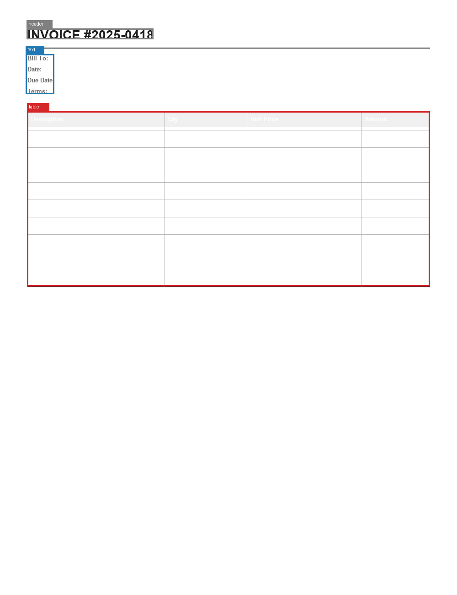

<div align="center">

# doclayout · 文档智能版面分析

**基于 PP-StructureV3 的文档版面分割 + 表格识别 — 上传文档图像，自动分割结构区域**

[English](./README.en.md) | 中文


</div>

<div align="center">



版面分割实测：PP-StructureV3 区分 `doc_title` / `paragraph_title` / `figure_title` / `text` / `table` 等细粒度区域类型，并对表格区域还原为 HTML 结构

</div>

## 核心结论

> **PP-StructureV3 一个 pipeline 同时输出区域分割与表格 HTML 结构，且能区分 `doc_title`/`paragraph_title`/`figure_title`/`chart`/`header` 等细粒度类型——比 PubLayNet 的 5 类更丰富。**
>
> 量化指标（mAP）依赖 PubLayNet val 数据，当前为**占位实现，待数据到位后回填**（见下文"评估状态"）。在此之前，本 README 不报任何具体数字，避免误导。

| 维度 | 状态 |
|------|------|
| 版面分割 | ✅ 实测可用，区分细粒度区域类型（定性） |
| 表格识别 | ✅ 实测可用，还原为 HTML 结构（定性） |
| mAP 量化 | ⏳ 占位实现（`evaluate.py` 会 `NotImplementedError`），待 PubLayNet val 数据 + pycocotools |

---

## 项目简介

`doclayout` 是一个文档智能系统，对文档图像进行版面分析：自动识别标题、正文、表格、图片、列表等结构区域，并对表格区域进行结构识别（还原为 HTML）。底层使用 **PaddleOCR PP-StructureV3**（2025 最新版），一个 pipeline 同时完成版面分割 + 表格结构识别。

这是一个**文档智能方向**的项目，聚焦版面分割与表格结构识别。

## 核心亮点

- **一体化版面 + 表格引擎**：PP-StructureV3 一个 pipeline 同时输出区域分割（text/title/table/figure/...）和表格 HTML 结构，无需拼接多个模型。
- **丰富的区域类型**：实测 PP-StructureV3 3.7 能区分 `doc_title`/`paragraph_title`/`figure_title`/`chart`/`header` 等细粒度类型，比 PubLayNet 的 5 类更丰富。
- **交互式可视化看板**：Streamlit 上传任意文档图像 → 实时推理 → 彩色标注框 + 表格 HTML 渲染。
- **工程化扎实**：CI（lint + test）、双入口（Makefile + run_all.py）、`--quick` 模式、类别映射 + bbox 格式转换适配层。
- **实测解决的工程坑**：paddlepaddle 3.3 的 oneDNN PIR bug（自动禁用）、CPU 内存回归（环境变量限制）、PP-StructureV3 版本敏感的 schema 差异（探测适配）。

## 技术架构

```
文档图像
    │
    ▼
PP-StructureV3 (PaddleOCR 3.7)
    │  ├── 版面检测 (PP-DocLayout_plus-L)
    │  ├── 表格结构识别 (SLANeXt + SLANet_plus)
    │  └── 文字 OCR (PP-OCRv5)
    │
    ▼
detect.py 适配层
    │  ├── schema 探测：res.parsing_res_list (实测, 非 API 文档描述)
    │  ├── 类别映射：PP label → PubLayNet 5 类
    │  └── bbox 转换：[x1,y1,x2,y2] → [x,y,w,h]
    │
    ▼
可视化 / 看板
    ├── PIL 彩色标注框 (每类一色)
    └── 表格 HTML 渲染
```

## 快速开始

```bash
# 1. 创建并激活 Python 3.11 虚拟环境
python -m venv .venv
# Linux / macOS: source .venv/bin/activate
# Windows PowerShell: .venv\Scripts\Activate.ps1

# 2. 安装（CPU；包含 PaddleOCR 与本项目包）
make setup
# Windows 无 GNU Make：python -m pip install -r requirements.txt
#                    python -m pip install -e ".[dev]"

# 3. 生成样本文档 + 推理 + 可视化
make all              # samples → detect → visualize

# 4. 启动交互式看板（上传任意文档图像）
make dashboard

# 5. 单图推理
python -m doclayout.detect --image samples/sample_paper.png
```

## 检测能力（实测）

PP-StructureV3 在三种合成文档上的实测区域识别（真实渲染文字，非灰色占位条）：

| 样本 | 检测到的区域类型 |
|------|------------------|
| 学术论文 | `doc_title`, `paragraph_title`, `figure_title`, `text` ×4, `table` |
| 商业报告 | `chart`, `figure_title`, `paragraph_title`, `table`, `text` |
| 发票 | `header`, `table`, `text` |

<div align="center">



</div>

> 样本文档由 `src/doclayout/make_samples.py` 用系统字体渲染生成（含真实文字，使 OCR 能识别 text 区域）。

## 评估状态（mAP 为占位，诚实说明）

mAP 量化评估需要 PubLayNet val 数据（11K 图，COCO format）。该数据集的获取当前受网络限制（IBM DAX 链接不可靠，HF 镜像为 parquet 格式且连接不稳定），且当前环境未安装 `pycocotools`。

- **`evaluate.py` 当前为占位实现**：会以 `NotImplementedError` 快速失败，提示需要手动准备数据并安装 `pycocotools`。
- **后续工作**：实现 PubLayNet COCOeval 适配后，再使用 `python -m doclayout.evaluate --quick` 产出 mAP，并回填本 README 与 `reports/metrics.json`；当前版本不把该命令列入可运行快速开始。
- **在此之前，本 README 不报 mAP 数字**：上方"核心结论"与表格均以定性陈述代替，避免出现未经实测的数字。

## 关键设计决策

### 为什么选 PP-StructureV3 而非 LayoutLMv3 / DETR / YOLO？

- **LayoutLMv3 不支持检测**：HF transformers 里的 LayoutLMv3 只有分类/NER head，不能输出 bbox（微软官方确认）。
- **通用 DETR 无文档类别**：`facebook/detr-resnet-50` 是 COCO 80 类，不含文档版面类别。
- **PP-StructureV3 开箱即用**：一个 pipeline 同时做版面 + 表格结构 + OCR，CPU 可跑，2025 年活跃维护。

### paddlepaddle 3.3 oneDNN bug

paddlepaddle 3.3.1 在 Windows CPU 上用 oneDNN 时，新 PIR 执行器会崩（`ConvertPirAttribute2RuntimeAttribute not support`）。解法：`enable_mkldnn=False`（速度损失但稳定）。见 `config.ENABLE_MKLDNN`。

### PP-StructureV3 schema 适配

API 文档描述的结果结构是 `parsing_res_list` 在顶层，但实测（paddleocr 3.7）实际在 `page.json["res"]["parsing_res_list"]`，且字段名是 `block_label`/`block_bbox`（非文档说的 `layout_type`/`layout_bbox`）。`detect.py` 用 `res.` 嵌套 + 双字段名 fallback 适配，不硬编码。

<details>
<summary><b>技术栈 / 项目结构 / 质量保障</b></summary>

#### 技术栈

| 层级 | 工具 | 说明 |
|------|------|------|
| 引擎 | PP-StructureV3 (`paddleocr` 3.7) | 版面分割 + 表格结构一体化 |
| 后端 | paddlepaddle 3.3 (CPU) | 禁用 oneDNN 规避 PIR bug |
| 图像 | Pillow | 标注框绘制 + 样本生成 |
| 评估 | pycocotools + PubLayNet | mAP@[0.50:0.95]（占位实现，待数据；见"评估状态"） |
| 交付 | Streamlit | 交互式文档分析看板 |

#### 项目结构

```
doclayout/
├── src/doclayout/
│   ├── config.py             # 路径 + 类别映射 + ENABLE_MKLDNN + CPU 内存限制
│   ├── make_samples.py       # 生成含真实文字的样本文档（系统字体渲染）
│   ├── detect.py             # PP-StructureV3 推理 + schema 适配 + COCO 输出
│   ├── evaluate.py           # pycocotools mAP（占位：待实现 + 数据）
│   ├── download_data.py      # PubLayNet 数据下载（占位：网络源不稳定）
│   ├── visualize.py          # PIL 彩色标注框可视化
│   └── audit_consistency.py  # README mAP 校验
├── dashboard/app.py          # Streamlit 交互式文档分析
├── samples/                  # 合成样本文档（论文/报告/发票）
├── tests/                    # config + 类别映射测试
├── run_all.py / Makefile
└── README.md / CONTRIBUTING.md / LICENSE
```

#### 质量保障

| 层级 | 触发 | 命令 | 作用 |
|------|------|------|------|
| L1 | 每次 commit | pre-commit (ruff) | 格式、基础 lint |
| L2 | 每次 push/PR | GitHub Actions CI | lint + test（不装 paddle） |
| L3 | 手动 | `make verify` | lint + format-check + test + audit |

</details>

## 许可证

MIT
